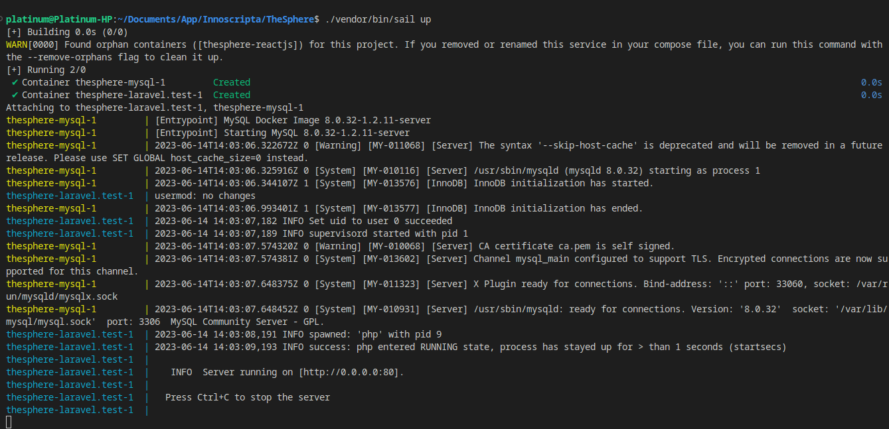
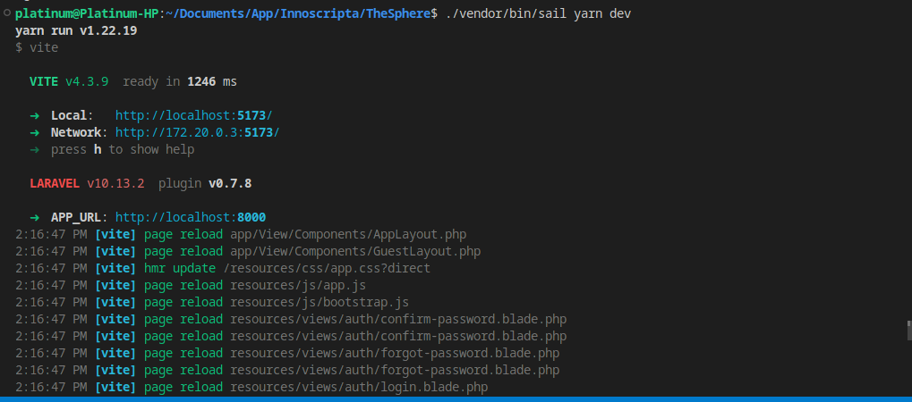
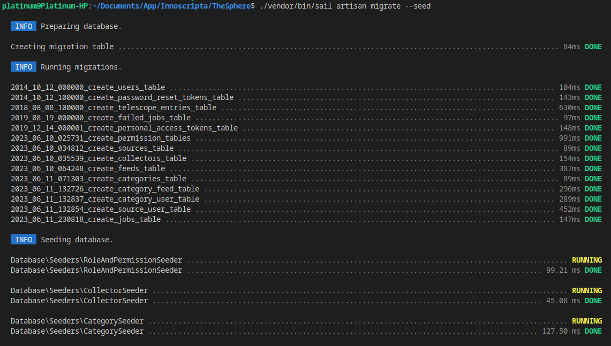
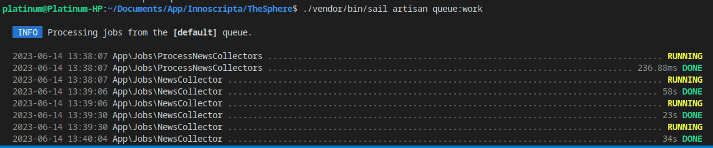
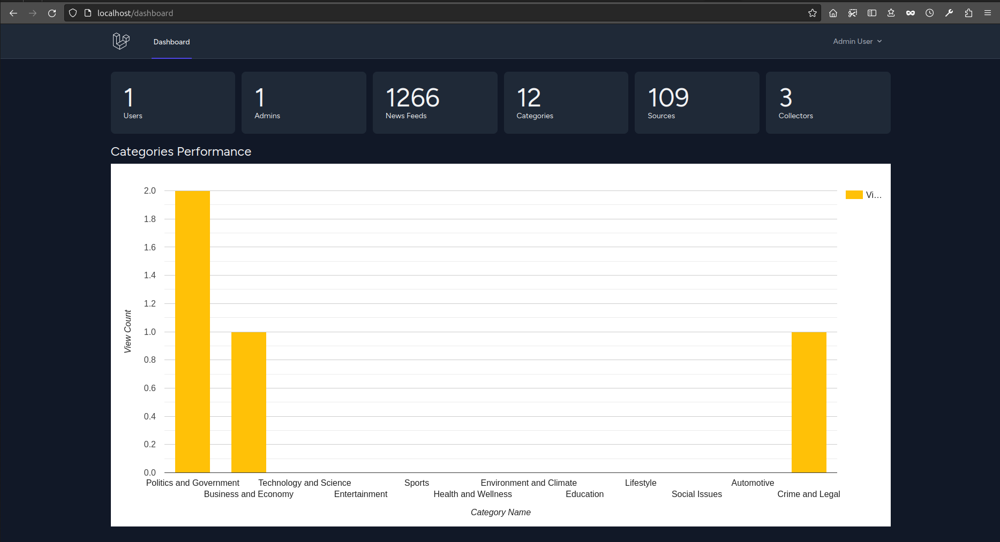

# TheSphere - Innoscripta Assessment
TheSphere is a news aggregator application with APIs that power a ReactJS frontend. Below are the steps to run the project:

## Getting Started

1. Clone the repository:
```bash
    git clone https://github.com/your-username/TheSphere.git
```
2. Navigate to the project directory:
```bash
    cd TheSphere
```
3. Set up environment variables:
- Rename the `.env.example` file to `.env`:
  ```bash
  cp .env.example .env
  ```
- Generate app key:  
  ```bash
  php artisan key:generate
  ```

- Open the `.env` file and configure the necessary environment variables, such as database connection details. (NOTE, I have updated the .env to be exactly what was used in the development so no change may be necessary)

4. Build and start the Docker containers:
> Have Docker engine running:
```bash
    composer install
    ./vendor/bin/sail up
```


- Start javasript libraries
```bash
    ./vendor/bin/sail yarn dev
```


- Run Migration and seed the database
```bash
./vendor/bin/sail artisan migrate --seed
```


- Start the Laravel queue worker
```bash
./vendor/bin/sail queue:work
```
- Navigate to `localhost/fetch-news`


> Now wait for the `queue` works to be completed, there's 4 of them and shuld look like this:



5. Access the application:
- Open a web browser and visit `http://localhost` to view the to access the admin dashboard and analytics, log in with the following credentials:
  - Email: admin@thesphere.com
  - Password: password




6. Setup the Frontend Application here: [TheSphere Frontend](https://github.com/ThePlatinum/thesphere---frontend#readme)
